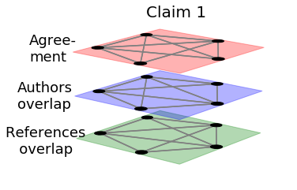
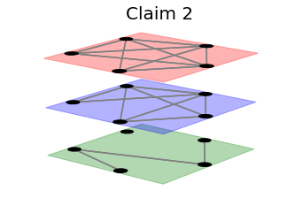
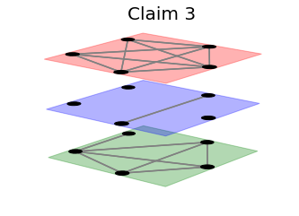
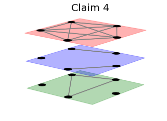
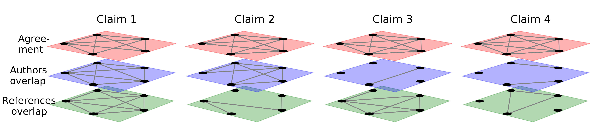

```python
from pymnet import *
import random
%matplotlib inline
```


```python
##### from itertools import combinations 

def draw_four_graphs(w,h, font_size_1, font_size_2):
    import numpy as np
    comb = list(combinations([1, 2, 3, 4, 5], 2))
    indices_1 = np.random.choice([1,2,3,4,5,6,7,8,9,0], size = 9 ,replace = False)
    comb_1 = []
    for i in indices_1:
        comb_1.append(comb[i])

    indices_2 = np.random.choice([1,2,3,4,5,6,7,8,9,0], size = 9 ,replace = False)
    comb_2 = []
    for i in indices_2:
        comb_2.append(comb[i])

    indices_3 = np.random.choice([1,2,3,4,5,6,7,8,9,0], size = 9 ,replace = False)    
    comb_3 = []
    for i in indices_3:
        comb_3.append(comb[i])


    mnet_3 = MultilayerNetwork(aspects=1)
    mnet_3.add_node(1)
    first = "Agree-\nment"
    sec = "Authors\noverlap"
    third = "References \n   overlap"

    for i in comb_1:
        mnet_3[i[0], first][i[1], first] = 1

    for i in comb_2:
        mnet_3[i[0], sec][i[1], sec] = 1

    for i in comb_3:
        mnet_3[i[0], third][i[1], third] = 1

    a = draw(mnet_3, layout="circular",
            nodeLabelRule={},
            layerColorDict={first: "red", sec: "blue",
                           third: "green"},
            defaultLayerAlpha=0.3,
            layerLabelSizeDict={first:font_size_1, sec:font_size_1, third:font_size_1},
            layerLabelLocDict={first: (-0.05, -0.4), 
                              sec: (-0.1, -0.5),
                              third: (-0.15, -0.6)})
    a.set_size_inches(w, h)
    a.text(0.45, 0.85,'Claim 1', size = font_size_2)
    a.savefig("fig_1_a.png", dpi = 300)
    
    mnet = MultilayerNetwork(aspects=1)
    mnet.add_node(1)
    first = "Agree-\nment"
    sec = "Authors\noverlap"
    third = "Reference\noverlap"

    #first layer
    mnet[1, first][2, first] = 1
    mnet[1, first][3, first] = 1
    mnet[1, first][4, first] = 1
    mnet[1, first][5, first] = 1
    mnet[2, first][3, first] = 1
    mnet[2, first][4, first] = 1
    mnet[2, first][5, first] = 1
    mnet[3, first][4, first] = 1
    mnet[3, first][5, first] = 1


    #second layer
    mnet[1, sec][2, sec] = 1
    mnet[1, sec][3, sec] = 1
    mnet[1, sec][5, sec] = 1
    mnet[2, sec][3, sec] = 1
    mnet[2, sec][4, sec] = 1
    mnet[3, sec][4, sec] = 1
    mnet[2, sec][5, sec] = 1
    mnet[3, sec][5, sec] = 1


    #third
    mnet[1, third][2, third] = 1
    mnet[1, third][4, third] = 1
    mnet[4, third][5, third] = 1

    b = draw(mnet, layout="circular",
            nodeLabelRule={},
            layerColorDict={first: "red", sec: "blue",
                           third: "green"},
            layerLabelDict={first:'', sec:'', third:''},
            defaultLayerAlpha=0.3)
    b.set_size_inches(w,h)
    b.text(0.45, 0.85,'Claim 2', size = font_size_2)
    b.savefig("fig_1_b.png", dpi = 300)

    mnet = MultilayerNetwork(aspects=1)
    mnet.add_node(1)
    first = "Agree-\nment"
    sec = "Authors\noverlap"
    third = "Reference\noverlap"

    #first layer
    mnet[1, first][2, first] = 1
    mnet[1, first][3, first] = 1
    mnet[1, first][4, first] = 1
    mnet[1, first][5, first] = 1
    mnet[2, first][3, first] = 1
    mnet[2, first][4, first] = 1
    mnet[2, first][5, first] = 1
    mnet[3, first][5, first] = 1
    mnet[4, first][5, first] = 1


    #second layer
    mnet[2, sec][5, sec] = 1


    #third
    mnet[1, third][2, third] = 1
    mnet[1, third][4, third] = 1
    mnet[1, third][5, third] = 1
    mnet[2, third][4, third] = 1
    mnet[3, third][4, third] = 1
    mnet[2, third][5, third] = 1
    mnet[4, third][5, third] = 1

    c = draw(mnet, layout="circular",
            nodeLabelRule={},
            layerColorDict={first: "red", sec: "blue",
                           third: "green"},
            defaultLayerAlpha=0.3,
            layerLabelSizeDict={"Agree-\nment":font_size_1, "Authors\noverlap":font_size_1, "Reference\noverlap":font_size_1},
            layerLabelDict={first:'', sec:'', third:''})
    c.set_size_inches(w,h)
    c.text(0.45, 0.85,'Claim 3', size = font_size_2)
    c.savefig("fig_1_c.png", dpi = 300 )
    
    comb_1 = combinations([1, 2, 3, 4], 2) 
    comb_2 = combinations([2, 3, 5], 2)
    comb_3 = combinations([1, 2, 3, 4, 5], 2) 

    mnet_2 = MultilayerNetwork(aspects=1)
    mnet_2.add_node(1)
    first = "Agree-\nment"
    sec = "Authors\noverlap"
    third = "Reference\noverlap"

    #first layer
    for i in comb_3:
        mnet_2[i[0], first][i[1], first] = 1


    #second layer
    mnet_2[1, sec][5, sec] = 1
    mnet_2[2, sec][3, sec] = 1


    #third layer
    for j in comb_2:
        mnet_2[j[0], third][j[1], third] = 1


    d = draw(mnet_2, layout="circular",
            nodeLabelRule={},
            layerColorDict={first: "red", sec: "blue",
                           third: "green"},
            defaultLayerAlpha=0.3,
            layerLabelSizeDict={"Agree-\nment":font_size_1, "Authors\noverlap":font_size_1, "Reference\noverlap":font_size_1},
            layerLabelDict={first:'', sec:'', third:''})
    d.set_size_inches(w,h)
    d.text(0.45, 0.85,'Claim 4', size = font_size_2)
    d.savefig("fig_1_d.png", dpi = 300)


```


```python
from PIL import Image

draw_four_graphs(5.6, 4, 18, 20)

files = ['fig_1_a.png', 'fig_1_b.png', 'fig_1_c.png', 'fig_1_d.png']

for index, file in enumerate(files):
    if index != 0:
        img = Image.open(file)
        w, h = img.size
        area = (0 + 300, 0, w-300, h-100)
        cropped_img = img.crop(area)
        cropped_img.save(file)
    if index == 0:
        img = Image.open(file)
        w, h = img.size
        area = (0, 0, w-300, h-100)
        cropped_img = img.crop(area)
        cropped_img.save(file)        
```














```python
files = ['fig_1_a.png', 'fig_1_b.png', 'fig_1_c.png', 'fig_1_d.png']
img_1 = Image.open(files[0])
w_1, h_1 = img_1.size

img_2 = Image.open(files[1])
w_2, h_2 = img_2.size

img_3 = Image.open(files[2])
w_3, h_3 = img_3.size

img_4 = Image.open(files[3])
w_4, h_4 = img_4.size

result = Image.new("RGB", (w_1 + w_2 + w_3 + w_4, h_1))
result.paste(img_1)

result.paste(img_2, (w_1, 0, w_1 + w_2, h_1))
result.paste(img_3, (w_1 + w_2 , 0, w_1 + w_2 + w_3, h_1))
result.paste(img_4, (w_1 + w_2 + w_3 , 0, w_1 + w_2 + w_3 + w_4, h_1))

result.save('output.png')
result
```





